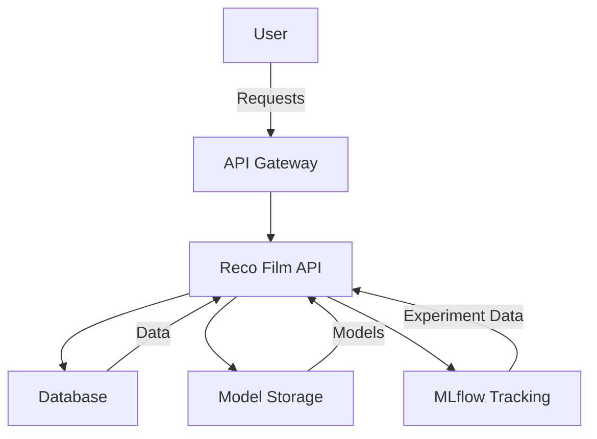

# Reco Film

This project aims to provide a service to recommend movies to users. It is developed as the final project of MLOps formation from DataScientest.

## Run the project

This project uses a [docker-compose](docker-compose.yml) to provides `services` relatives to our projects.
Here is the list of all our services:
* `api` provides project API 
* `dev` to develop the project using a docker container

First build docker images:
```
docker-compose build
```

### Run API

**NB:** You can run API with the credentials: `username`: 'alice', `password`: 'x'.

* Run API:
```
docker compose up api
```

When the API is running, the API documentation is provided here: [http://172.19.0.5:8000/docs](http://172.19.0.5:8000/docs).

* Test API:
```
curl -X GET -i http://172.19.0.5:8000/
```

* Infer using model into API:
```
curl -X 'GET' \
  'http://localhost:8000/recommend/1' \
  -H 'accept: application/json'
```

* Kill API:
```
docker container stop reco_api
```

### Dev mode

* Run the dev container:
```
docker compose run --rm dev
```

You are now inside the container. 

* Construct the dataset:
```
poetry run python app.py dataset
```

* Prediction:
```
poetry run python app.py predict
```

* Test
```
poetry run pytest -s
```

### Dev API
* Run API:
```
uvicorn api:api --host 0.0.0.0 --port 8000 --reload
```

* See doc here:[http://localhost:8000/docs](http://localhost:8000/docs)


## CI/CD and Testing

This project uses several tools to ensure quality and continuous integration:

### MLflow

MLflow is used for tracking experiments, packaging code into reproducible runs, and sharing and deploying models. It helps in managing the machine learning lifecycle, including experimentation, reproducibility, and deployment.

### Pytest

Pytest is used for writing and running tests. It is a mature testing framework that supports simple unit tests as well as complex functional testing. To run the tests, use the following command:

```
poetry run pytest -s
```

### GitHub Actions

GitHub Actions is used for automating workflows, including running tests and deploying the application. It helps in setting up a CI/CD pipeline to ensure that the code is always in a deployable state.
* [Cahier des charges](https://docs.google.com/document/d/11B940u5Z8is7Wlj7b0wzkA4UE-wqW9eDQh4Fcw8SisY/edit?usp=sharing)

### 0. Dev choices

* To develop we recommend to use VSCode with extension [ruff](https://marketplace.visualstudio.com/items?itemName=charliermarsh.ruff).

* We choose to use [poetry](https://python-poetry.org/) instead of `requirement.txt` because it *Python packaging and dependency management made easy*.


### 1. Architecture

The architecture of the Reco Film project is designed to efficiently handle movie recommendations through a microservices approach. Below is a detailed architecture diagram:



- **API Gateway**: Manages incoming requests and routes them to the appropriate services.
- **Reco Film API**: The core service that handles movie recommendation logic.
- **Database**: Stores user data, movie data, and other necessary information.
- **Model Storage**: Contains machine learning models used for generating recommendations.
- **MLflow Tracking**: Manages the lifecycle of machine learning experiments.

### 2. Docker and Docker-compose

The project uses Docker and Docker Compose to manage and run services in isolated environments. The `docker-compose.yml` file defines the following services:

- **api**: This service runs the FastAPI application, which serves the movie recommendation API. It is built from the `Dockerfile` and exposes port 8000 for API access.
- **test_api**: A service used for testing the API, ensuring it is functioning correctly. It depends on the `api` service and uses the same network.
- **dev**: A development environment that includes all necessary dependencies and tools for building and testing the application. It mounts local directories for live development and uses the host network mode.
- **mlflow-server**: This service runs the MLflow server for tracking experiments and managing the machine learning lifecycle. It exposes port 5000 for accessing the MLflow UI.

The services are connected through a custom Docker network named `reco_network`, which allows them to communicate with each other using predefined IP addresses.

To build and run the services, use the following commands:

- Build the Docker images:
  ```
  docker-compose build
  ```

- Run the API service:
  ```
  docker-compose up api
  ```

- Run the development environment:
  ```
  docker-compose run --rm dev
  ```

- Run the MLflow server:
  ```
  docker-compose up mlflow-server
  ```

These services ensure that the application is scalable, maintainable, and easy to deploy.

### 3. API
[API](api.py) is implemented using [FastAPI](https://fastapi.tiangolo.com/). It contains a `dict` object to record user names and passwords. Passwords are encoded using [md5 algorithm](https://www.geeksforgeeks.org/md5-hash-python/).


## Useful
* [project template](https://github.com/DataScientest-Studio/Template_MLOps_movie_recommandation)
* [project board](https://github.com/users/Chrisdml/projects/1)
